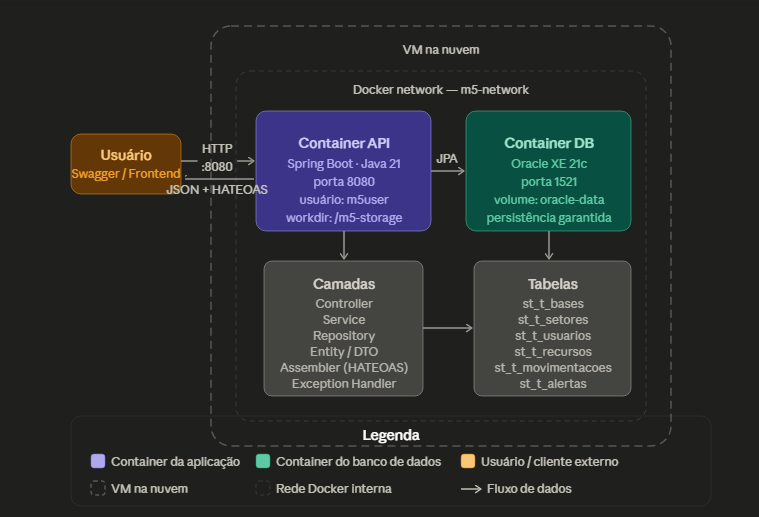

# M5-Storage API — Sistema de Gestão de Recursos

O M5-Storage é uma API REST desenvolvida em Java com Spring Boot para gerenciamento operacional de recursos em bases e setores. O sistema utiliza Oracle Database para persistência de dados, arquitetura em camadas, DTOs com Java Records, validações com Bean Validation, HATEOAS e documentação interativa com Swagger.

A plataforma foi criada para facilitar o controle de recursos críticos em ambientes operacionais. Entre os principais benefícios estão:

- monitoramento em tempo real do status dos recursos
- geração automática de alertas para recursos críticos
- controle de consumo e reabastecimento por setor
- histórico permanente de movimentações
- dashboard segmentado por base e setor
- controle de acesso por tipo de usuário (Operator e Viewer)
- rastreabilidade completa de todas as operações

---

## Arquitetura



---

## Tecnologias Utilizadas

- Java 21
- Spring Boot
- Maven
- Spring Data JPA / Hibernate
- Oracle Database 21c XE
- Spring HATEOAS
- Swagger / OpenAPI
- Lombok
- Docker / Docker Compose

---

## Estrutura Hierárquica do Sistema

```
Base
 └── Setor
      └── Recurso
           └── Movimentação → Alerta
```

---

## Endpoints da API

### Bases
```http
GET    /bases
POST   /bases
GET    /bases/{id}
PUT    /bases/{id}
DELETE /bases/{id}
```

### Setores
```http
GET    /setores
POST   /setores
GET    /setores/{id}
GET    /setores/base/{baseId}
PUT    /setores/{id}
DELETE /setores/{id}
```

### Recursos
```http
GET    /recursos
POST   /recursos?usuarioId={id}
GET    /recursos/{id}
GET    /recursos/setor/{setorId}
GET    /recursos/base/{baseId}
GET    /recursos/status/{status}
PUT    /recursos/{id}?usuarioId={id}
DELETE /recursos/{id}?usuarioId={id}
```

### Movimentações
```http
POST   /movimentacoes
GET    /movimentacoes/recurso/{recursoId}
GET    /movimentacoes/usuario/{usuarioId}
GET    /movimentacoes/setor/{setorId}
GET    /movimentacoes/setor/{setorId}/tipo/{tipo}
GET    /movimentacoes/base/{baseId}
```

### Alertas
```http
GET    /alertas
GET    /alertas/recurso/{recursoId}
GET    /alertas/setor/{setorId}
GET    /alertas/base/{baseId}
PATCH  /alertas/{id}/resolver?usuarioId={id}
```

### Usuários
```http
GET    /usuarios
POST   /usuarios?solicitanteId={id}
GET    /usuarios/{id}
GET    /usuarios/base/{baseId}
PUT    /usuarios/{id}
DELETE /usuarios/{id}
```

---

## Tabelas do Banco de Dados

| Tabela | Descrição |
|---|---|
| `st_t_bases` | Bases do sistema |
| `st_t_setores` | Setores dentro das bases |
| `st_t_usuarios` | Usuários (Operator e Viewer) — SINGLE_TABLE |
| `st_t_recursos` | Recursos monitorados por setor |
| `st_t_movimentacoes` | Histórico de consumo e reabastecimento |
| `st_t_alertas` | Alertas gerados por recursos críticos |

---

# How to

## 1. Pré-requisitos

- Docker e Docker Compose instalados na máquina ou VM
- Git instalado

---

## 2. Clonar o Repositório

```bash
git clone <url-do-repositorio>
cd m5-storage
```

---

## 3. Configurar o arquivo `.env`

```bash
touch .env
nano .env
```

Conteúdo do `.env`:

```env
# Oracle Database
ORACLE_PASSWORD=senha_sys
ORACLE_DATABASE=m5storage

# Usuário da aplicação no banco
APP_USER=m5user
APP_USER_PASSWORD=senha_app

# Spring Datasource — não altere a URL
SPRING_DATASOURCE_URL=jdbc:oracle:thin:@//oracle-db:1521/m5storage
```

Salve com `Ctrl+O` e saia com `Ctrl+X`.

---

## 4. Subir os containers

```bash
docker compose up -d --build
```

Na **primeira execução**, o Oracle leva aproximadamente 3 minutos para inicializar.

Acompanhe o progresso com:

```bash
docker logs -f rm563045-oracle-db
```

Quando aparecer a mensagem abaixo, o banco está pronto e a API sobe automaticamente:

```
DATABASE IS READY TO USE!
```

---

## 5. Ver os logs de ambos os containers

```bash
docker logs rm563045-oracle-db
docker logs rm563045-m5-storage
```

---

## 6. Acessar os containers

### Container da API

```bash
docker container exec -it rm563045-m5-storage bash
```

Dentro do container:

```bash
# diretório de trabalho
pwd

# estrutura de diretórios
ls -l

# usuário conectado
whoami
```

Saída esperada:
```
/m5-storage
total 4
-rw-r--r-- 1 m5user m5group ... app.jar
m5user
```

### Container do Banco

```bash
docker container exec -it rm563045-oracle-db bash
```

Dentro do container:

```bash
pwd
ls -l
whoami
```

---

## 7. Verificar persistência no banco

Conecte no Oracle dentro do container:

```bash
docker exec -it rm563045-oracle-db sqlplus ${APP_USER}/${APP_USER_PASSWORD}@//localhost:1521/${ORACLE_DATABASE}
```

Liste as tabelas criadas pelo Spring:

```sql
SELECT table_name FROM user_tables ORDER BY table_name;
```

Consulte dados persistidos:

```sql
SELECT * FROM st_t_bases;
SELECT * FROM st_t_setores;
SELECT * FROM st_t_usuarios;
SELECT * FROM st_t_recursos;
SELECT * FROM st_t_movimentacoes;
SELECT * FROM st_t_alertas;
```

Saia com:

```sql
EXIT;
```

---

## 8. Testar a API

Acesse o Swagger no navegador:

```
http://localhost:8080/swagger-ui/index.html
```

Ou se estiver em uma VM na nuvem:

```
http://<IP_PUBLICO>:8080/swagger-ui/index.html
```

---

## 9. Comandos úteis

| Ação | Comando                              |
|---|--------------------------------------|
| Ver logs da API | `docker logs -f rm563045-m5-storage` |
| Ver logs do banco | `docker logs -f rm563045-oracle-db`  |
| Parar tudo | `docker compose down`                |
| Parar e apagar os dados | `docker compose down -v`             |
| Reiniciar só a API | `docker compose restart api`         |
| Ver containers rodando | `docker ps`                          |

---

## Tratamento de Exceções

| Situação | Status HTTP |
|---|---|
| Registro não encontrado | 404 Not Found |
| Acesso negado (Viewer em operação de escrita) | 403 Forbidden |
| Dados inválidos ou regra de negócio violada | 400 Bad Request |
| Email ou dado duplicado | 409 Conflict |
| Método HTTP não suportado | 405 Method Not Allowed |
| Tipo de conteúdo inválido | 415 Unsupported Media Type |
| Erro interno | 500 Internal Server Error |

---

## Swagger

```
http://{IP_PUBLICO}:8080/swagger-ui/index.html
```